# SAIL Specification

**Software Architecture Iconographic Language**

## Contents

- [Chapter 1: Introduction to SAIL](#chapter-1)
  - [1.1 What is SAIL?](#section-1-1)
  - [1.2 The Core Philosophy](#section-1-2)
  - [1.3 The Three + 1 Pillars of SAIL](#section-1-3)
- [Chapter 2: Core Concepts & Notation](#chapter-2)
  - [2.1 The Iconographic Approach](#section-2-1)
  - [2.2 Basic Iconography: Type vs. Kind](#section-2-2)
  - [2.3 The Universal Element Structure](#section-2-3)
- [Chapter 3: SAIL Elements Catalog](#chapter-3)
  - [3.1 Overview](#section-3-1)
  - [3.2 Boundary Participant](#section-3-2)
  - [3.3 System](#section-3-3)
  - [3.4 Datastore](#section-3-4)
  - [3.5 Service Unit](#section-3-5)
  - [3.6 Communication Pathway](#section-3-6)
  - [3.7 Interface](#section-3-7)
  - [3.8 Interaction](#section-3-8)
- [Chapter 4: Structural Architecture](#chapter-4)
  - [4.1 Purpose and Scope](#section-4-1)
  - [4.2 Diagram: The Structural Context](#section-4-2)
  - [4.3 Diagram: Hierarchical Decomposition](#section-4-3)
  - [4.4 Interface Definitions](#section-4-4)
- [Chapter 5: Behavioral Architecture](#chapter-5)
  - [5.1 Purpose and Scope](#section-5-1)
  - [5.2 Diagram: The Behavioral Context](#section-5-2)
  - [5.3 Diagram: Interaction Breakdown](#section-5-3)
  - [5.4 Diagram: Process Diagrams](#section-5-4)
- [Chapter 6: Intrinsic Architecture](#chapter-6)
  - [6.1 Purpose and Scope](#section-6-1)
  - [6.2 Intrinsic Elements](#section-6-2)
  - [6.3 Diagram: The Characteristic Map](#section-6-3)
  - [6.4 Recommended Categories by Element](#section-6-4)
- [Chapter 7: Enhancing Diagrams](#chapter-7)
  - [7.1 The Principle of Semantic Independence](#section-7-1)
  - [7.2 Visual Organization: Context Groups](#section-7-2)
  - [7.3 Notations](#section-7-3)
  - [7.4 Use of Color](#section-7-4)
  - [7.5 The Stand-In Element](#section-7-5)
- [Chapter 8: Validation Rules](#chapter-8)
  - [8.1 Structural Rules](#section-8-1)
  - [8.2 Behavioral Rules](#section-8-2)
  - [8.3 Intrinsic Rules](#section-8-3)
  - [8.4 Cross-Pillar Consistency](#section-8-4)
  - [8.5 Validation Checklist](#section-8-5)
- [Chapter 9: Extending SAIL](#chapter-9)
  - [9.1 The Extension Philosophy](#section-9-1)
  - [9.2 Extending Iconography (Kinds)](#section-9-2)
  - [9.3 Extending Intrinsic Categories](#section-9-3)
  - [9.4 Creating a Dialect](#section-9-4)
- [Chapter 10: Summary and Conclusion](#chapter-10)
  - [10.1 Review of Benefits](#section-10-1)
  - [10.2 Adopting SAIL in an Organization](#section-10-2)
  - [10.3 Future Outlook](#section-10-3)

---

# Chapter 1: Introduction to SAIL

## 1.1 What is SAIL?

**SAIL (Software Architecture Iconographic Language)** is a formal visual language designed for modeling software architecture at the system level. It provides a standardized vocabulary of graphic symbols and diagram elements that replace ambiguous “box-and-line” diagrams with precise, semantic models.

In the complex landscape of modern software development, clarity is often the first casualty. Technical diagrams often suffer from two extremes: they are either too high-level and vague for developers to implement, or too detailed and arcane for business stakeholders to understand. SAIL was created to bridge this gap.

### The Architectural Gap

To understand where SAIL fits, it is helpful to view the hierarchy of architectural modeling:

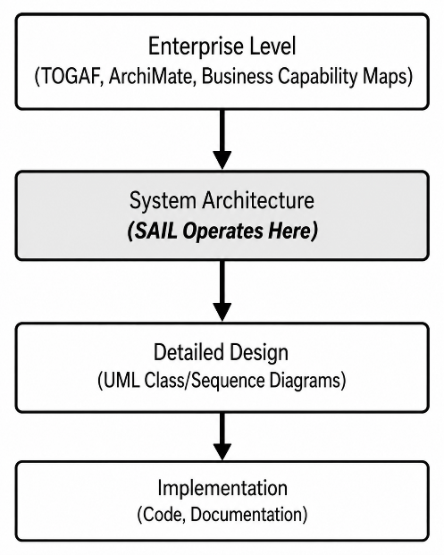

1.  **Enterprise Architecture (Top Level):** Frameworks like TOGAF or ArchiMate operate here. They describe high-level business capabilities, enterprise strategy, and portfolio management. They answer *why* the business needs technology but lack the detail to explain *how* a specific system is built.

2.  **System Architecture (The SAIL Level):** This is the critical middle layer. It defines the boundaries, components, integrations, and behaviors of specific software systems. It answers *what* the system is composed of and *how* its parts interact to fulfill business goals.

3.  **Detailed Design (Bottom Level):** Notations like UML (Class diagrams, Sequence diagrams) or actual code operate here. They describe the internal logic of classes, methods, and data structures.

SAIL operates at the **System Architecture** level. It models systems down to the component level (called *Service Units*) but stops before dictating internal implementation details. This boundary is deliberate: it provides a rigid blueprint for *what* needs to be built while leaving the *how*—the algorithms and code structure—to the developers’ discretion.

### Target Audience

Because SAIL bridges the gap between strategy and implementation, it serves three distinct audiences:

- **Business Stakeholders:** Can read SAIL diagrams to verify that the system scope and behaviors align with business requirements, without needing to decipher code-level jargon.

- **Solution Architects:** Use SAIL to define system boundaries, interfaces, and non-functional requirements in a way that can be maintained and communicated.

- **Development Teams:** Use SAIL as the authoritative “blueprint” for implementation, understanding component responsibilities, required interfaces, and quality constraints before writing code.

## 1.2 The Core Philosophy

SAIL is built on the belief that architecture should be accessible, not exclusive. Its design is guided by four core principles:

### 1. Clarity Over Ambiguity

In ad-hoc diagramming, a rectangle might represent a server, a database, or a piece of code, depending on the author’s mood. In SAIL, every shape and symbol has a single, specific meaning. If you see a circle, it is always a *System*. If you see a square with a heavy left border, it is always a *Datastore*. This eliminates the cognitive load of deciphering the notation, allowing the viewer to focus on the architecture itself.

### 2. Simplicity and Minimalism

SAIL diagrams are designed to be readable. The notation avoids visual clutter. If a detail does not aid in understanding the system’s architecture at the current level of abstraction, it is omitted. This principle of “Progressive Disclosure” allows diagrams to start simple and reveal complexity only when the viewer “drills down” into a specific area.

### 3. Accessibility

Architecture documents often collect dust because they are unintelligible to non-specialists. SAIL uses an *iconographic* approach—using recognizable symbols and clear layouts—to make diagrams intuitive. A project manager or product owner should be able to look at a SAIL Context Diagram and understand the system’s scope and external dependencies.

### 4. System-of-Systems Thinking

Modern software almost never exists in isolation. SAIL treats every element as part of a larger whole. A “System” in one diagram can be opened up to reveal it is composed of smaller “Systems,” which in turn might interact with other Systems until the decomposition reaches a point of single responsibility. We call this point a **Service Unit**. This hierarchical approach allows architects to model complex ecosystems without losing sight of the big picture.

## 1.3 The Three + 1 Pillars of SAIL

To provide a complete picture of a software system, SAIL divides architectural concerns into three distinct **“Pillars”** which represent the reality of the system. These pillars are governed by a **Contract Layer** (Interfaces) that facilitates communication between them.

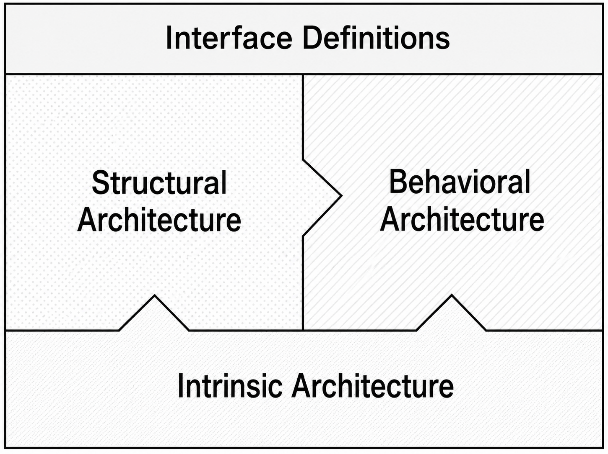

### 1. Structural Architecture (The Form)

- ***The Static View.*** Defines **what the system is**—the components, hierarchies, boundaries, and physical connections. It provides the “skeleton” of the architecture, identifying the persistent inventory of Systems, Service Units, and Datastores.

### 2. Behavioral Architecture (The Function)

- ***The Dynamic View.*** Defines **what the system does**—the flows, sequences, and interactions that occur over time. It maps how the structural elements collaborate to fulfill business scenarios and process logic.

### 3. Intrinsic Architecture (The Foundation)

- ***The Qualities.*** Defines **how well the system performs**—capturing the constraints, goals, and non-functional requirements (such as security, scalability, and compliance). This pillar exerts upward pressure, shaping the decisions made in the Structural and Behavioral layers.

### +1. Interface Definitions (The Contracts)

- ***The Rules of Engagement.*** Located at the top of the model, Interfaces define the formal contracts—operations, schemas, and protocols—that allow elements to talk to one another.

- ***Pragmatic Application.*** While formal interfaces are required for major system boundaries (external facing) and complex internal integrations, SAIL is pragmatic: simpler internal pathways (like a direct method call or database read) may exist without a formal interface definition if the complexity doesn’t warrant it.

### Conceptual Interlock

These elements are not separate documents; they are different views of the same single reality:

- **Structure and Behavior** define the execution of the system.

- **Intrinsic** defines the constraints and success criteria for that execution.

- **Interfaces** define the language spoken during that execution.

# Chapter 2: Core Concepts & Notation

## 2.1 The Iconographic Approach

Standard architectural diagrams often suffer from “notation drift.” A box in one diagram might mean “server,” while in another, it might mean “process step.” When symbols are ambiguous, readers must decode the author’s intent instead of focusing on the architecture.

SAIL solves this by giving each visual element a stable architectural meaning.

### Icons vs. SAIL Symbols

In SAIL, an icon is only one part of a complete symbol:

- An **Icon** is a simple pictorial cue, such as a stick figure for a user.

- A **SAIL Symbol** is a standardized architectural element that combines shape, glyph, text, compartments, and markers into a single readable unit.

SAIL symbols are designed with deliberate “visual weight.” They are large enough to contain useful metadata, such as IDs and descriptions, but compact enough to remain readable when arranged in a hierarchy. This standardization ensures that a complex system diagram looks consistent, regardless of which tool or person created it.

## 2.2 Basic Iconography: Type vs. Kind

A central concept in SAIL is the distinction between an element’s **Type** and its **Kind**. This is represented by the “Container + Glyph” model.

### 1. Type (The Container Shape)

The *Type* is the high-level category of the element. It is communicated by the **outer shape** of the icon container. This allows a viewer to scan a diagram and recognize the role of an element without reading text.

- **Circle:** Always represents a **System** (a high-level container of functionality).

- **Square:** Always represents a **Boundary Participant** (an external actor).

- **Square with Left Border:** Always represents a **Datastore** (state/persistence).

- **Rectangle with Header:** Always represents a **Service Unit** (a single responsibility).

### 2. Kind (The Internal Glyph)

The *Kind* is the specific specialization of that Type. It is communicated by a small **pictorial glyph** placed inside the container shape.

- *Example:* A **Circle (System)** containing a **Cloud Glyph** reads as “A Cloud-Hosted System.”

- *Example:* A **Square (Boundary Participant)** containing a **Person Glyph** reads as “A Human User.”

- *Example:* A **Square (Boundary Participant)** containing a **Robot Glyph** reads as “An Automated Bot.”

This separation allows SAIL to be extensible. You can invent new “Kinds” (e.g., a domain language concept) without breaking the fundamental “Type” logic that holds the diagram together.

## 2.3 The Universal Element Structure

To ensure consistency, every structural element in SAIL follows a “Universal Element Structure.” This describes how the ideograph is laid out and where specific data must be placed. The notation supports **Progressive Disclosure**, allowing architects to show or hide compartments based on the level of detail required.

### Anatomy of an Ideograph

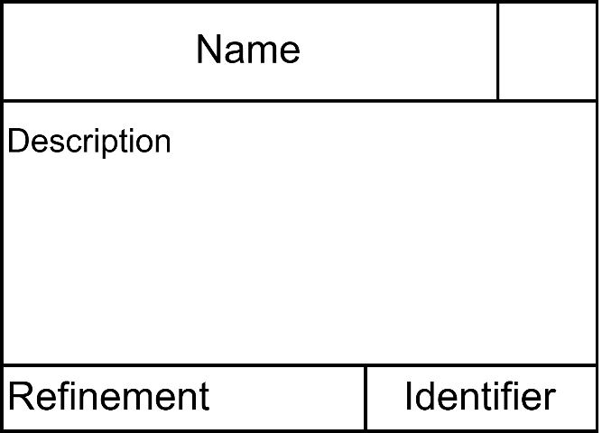

The ideograph is composed of stacked compartments. The visibility of these compartments is **context-dependent**. Architects may choose to hide certain sections on specific diagrams to reduce clutter or emphasize high-level structure.

#### 1. The Header (Always Visible)

The Header is the only mandatory component of the ideograph. It must appear in every representation of the element.

- **Element Name:** The primary label (e.g., “Order Processing”).

- **Icon Compartment:** A square box on the left housing the Type/Kind visual.

#### 2. The Body (Optional / Hideable)

- **Description:** A brief explanation of the element’s responsibility (e.g., “Validates and orchestrates customer orders”).

- *Usage Rule:* This compartment is often hidden in complex diagrams where space is limited or where the element’s function is already well-understood by the audience.

#### 3. Metadata Compartments (Optional / Hideable)

- **Identifier:** A dedicated slot for a unique reference code (e.g., SVC-102). Used for traceability to external requirements or code.

- **Refinement Tags:** Optional badges to indicate status or stereotypes (e.g., \<New\>, \<Legacy\>, \<External\>).

- *Usage Rule:* These are hidden in high-level executive summaries (Context Diagrams) but shown in detailed engineering views.

#### 4. Indicators (Generally Visible)

Small visual markers in the Header provide critical navigation cues. While generally shown, they may be omitted in rare cases if they distract from the specific diagram’s purpose. *Note: Behavioral and Intrinsic diagrams may have specific rules for these indicators, addressed in later chapters.*

- **Sub-Diagram Indicator (Hierarchy):** A **Solid Black Triangle** in the **upper-left** corner of the name compartment. If present, it signals that this element is a “container” that has a more detailed **Hierarchical Diagram** available.

- **Multiple Instance Indicator (Aggregation):** Represented by **three small dots (ellipsis)** in the **upper-right** corner of the name compartment (just to the left of the icon compartment). This indicates that the single symbol represents a collection or cluster of identical instances.

- **Characteristic Map Indicator:** A **Single Dot** located at the **bottom-left** of the name compartment. This signals that the element has an associated **Intrinsic Characteristic Map**, allowing the reader to navigate to the non-functional requirements definition.

By adhering to this universal structure, SAIL ensures that every node in a diagram provides the same level of information and traceability, preventing the common problem of “mystery boxes” in architectural documentation.

# Chapter 3: SAIL Elements Catalog

## 3.1 Overview

This chapter defines the SAIL Inventory—the set of persistent architectural entities that comprise a system’s definition.

It is important to distinguish between these Elements, which exist as permanent records in the architecture model, and Diagrammatic Artifacts, such as lines, connectors, start nodes, end nodes, and flows, which are used only to visualize relationships or sequences in specific diagrams. The elements listed below are the “nouns” of the SAIL language; they are the things that are built, deployed, stored, invoked, or interacted with.

Behavioral elements are also part of this inventory. An Interaction is not merely a label on a diagram; it is a named unit of behavior that can appear in multiple behavioral views. A high-level interaction may be decomposed into smaller interactions, and a detailed interaction may be described by a Process Diagram. This allows SAIL to model behavior progressively, moving from broad scenario maps to precise execution flows without overloading a single diagram.

## 3.2 Boundary Participant

**Definition:** A Boundary Participant represents any entity that resides *outside* the scope of the system being modeled but interacts with it. They define the external context and boundaries of the architecture.

**Usage:** Boundary Participants appear on Context Diagrams (Structural and Behavioral) to show who or what is driving the system.

**Standard Kinds:**

| Kind            | Icon                                                                                         | Description                                                                               |
|-----------------|----------------------------------------------------------------------------------------------|-------------------------------------------------------------------------------------------|
| User            |  | Represents a human user interacting with the system.                                      |
| External System | 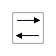 | Represents an external software system or service (e.g., Payment Gateway, Legacy ERP).    |
| Device          | 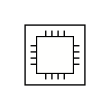 | Represents a hardware device or computing appliance (e.g., Mobile Phone, IoT Controller). |
| Sensor          |  | Represents a specialized hardware input device (e.g., Thermostat, Motion Sensor).         |

## 3.3 System

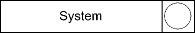

**Definition:** A System is a high-level container of functionality. It represents a deployable unit that operates independently. In the context of the architecture, it is the primary subject of design. Large systems may be composed of smaller Subsystems (which are also modeled as System elements).

**Usage:** Systems are the central focus of Context Diagrams and the parent containers in Hierarchical Diagrams.

**Standard Kinds:**

| Kind             | Icon                                                                                          | Description                                                                |
|------------------|-----------------------------------------------------------------------------------------------|----------------------------------------------------------------------------|
| Hosted API       |  | A system that exposes functionality via a network API (REST, gRPC, etc.).  |
| Service / Daemon |  | An autonomous background process or service with no direct user interface. |
| Interactive App  |  | A system with a visual user interface (Web App, Desktop App, Mobile App).  |
| CLI App          |  | A command-line utility or tool.                                            |

## 3.4 Datastore

**Definition:** A Datastore represents any component responsible for managing state, persistence, or buffering data. It is a specialized structural element distinct from processing units.

**Usage:** Datastores appear inside Hierarchical Diagrams to show where data resides or how it is transmitted between components.

**Standard Kinds:**

| Kind          | Icon                                                                                          | Description                                                    |
|---------------|-----------------------------------------------------------------------------------------------|----------------------------------------------------------------|
| Relational DB | 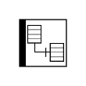 | A structured SQL database (e.g., PostgreSQL, SQL Server).      |
| NoSQL DB      |  | A document, key-value, or graph store (e.g., Mongo, Redis).    |
| File Storage  |  | A file system, blob storage, or object store (e.g., S3, Disk). |
| Queue         |  | A message queue or buffer (e.g., RabbitMQ, SQS).               |
| Bus           | 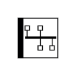 | An event streaming platform or bus (e.g., Kafka).              |

## 3.5 Service Unit

**Definition:** A Service Unit is the atomic structural building block in SAIL. It represents a modular component with a single responsibility. It is the lowest level of structural decomposition; SAIL does not model the internal classes or functions within a Service Unit.

**Usage:** Service Units appear in Hierarchical Diagrams as the leaf nodes that perform the actual work of the system.

**Standard Kinds:**

| Kind          | Icon                                                                                          | Description                                                                                                                                                                                                                                                          |
|---------------|-----------------------------------------------------------------------------------------------|----------------------------------------------------------------------------------------------------------------------------------------------------------------------------------------------------------------------------------------------------------------------|
| API Handler   |  | A component responsible for handling API requests and routing logic.                                                                                                                                                                                                 |
| UI Component  |  | A specific view or module within a frontend application.                                                                                                                                                                                                             |
| Integration   | 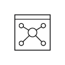 | A component dedicated to managing connections with external systems (Adapters/Proxies).                                                                                                                                                                              |
| Orchestrator  | 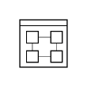 | A component that manages complex workflows or business process logic.                                                                                                                                                                                                |
| Library       |  | A shared code library or utility package used by other units.                                                                                                                                                                                                        |
| Closed Source |  | A component that is purchased off the shelf that exposes and API but whose internals are unknown.                                                                                                                                                                    |
| Processor     |  | A component dedicated to applying deterministic computation to an input to produce an output (e.g., rules evaluation, classification, scoring, transformation). It may call helper services, but it does **not** own end-to-end workflow across multiple components. |

## 3.6 Communication Pathway

A **Communication Pathway** represents a communication relationship between two elements on a **Structural Diagram**. It is used to show that information can flow between the connected elements, without requiring the diagram to commit to protocol, message shape, or implementation detail.

A Communication Pathway is drawn as a **single line** between two elements. To eliminate ambiguity about interface ownership, every Communication Pathway **must** include a **provider marker**.

The provider marker is a **small solid square** placed on the end of the line that connects to the element that **provides or implements** the interface. The opposite end of the line has **no marker** and represents the **consumer** of that interface. This simple visual cue makes it obvious which element owns each contract, even when the pathway is unlabeled.

Communication Pathways may be **unlabeled**. Labels are **not required**. In many cases, a pathway exists only to show a relationship, or it represents an internal call or simple connection where no formal interface is defined (for example, a component making SQL calls to a database). In these cases, the pathway remains unlabeled.

When a label **is** shown on a Communication Pathway, the label indicates that a defined **Interface** exists and is associated with that pathway. In other words:

- **Unlabeled pathway**: a relationship exists; an Interface may not be defined.

- **Labeled pathway**: a relationship exists; an associated Interface **is defined,** and the pathway is referencing it.

## 3.7 Interface

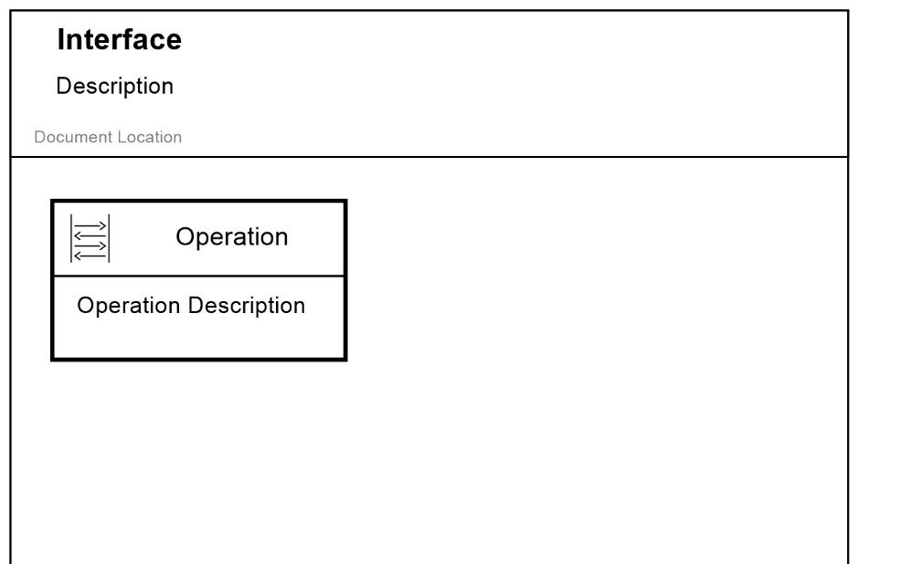

**Definition:** An Interface is a formal, reusable contract that defines a set of operations for interaction. It exists independently of the components that implement it. While “Communication Pathways” are drawn on diagrams to show connections, the **Interface** is the underlying inventory element that defines *what* is being communicated.

**Properties:**

- **Name:** Unique identifier (Format: Name Type (Technology)).

- **Description:** Summary of purpose.

- **Documentation Location:** Pointer to the full technical spec (Swagger, Protobuf, etc.).

- **Operations:** A collection of discrete actions defined by the contract.

**Operations:** The core of an Interface is its list of Operations. Each operation represents a specific action or message exchange pattern supported by the interface.

**Operation Kinds:** SAIL defines eight standard kinds of operations to describe how data flows:

| Kind              | Icon                                                                                           | Description                                                                             |
|-------------------|------------------------------------------------------------------------------------------------|-----------------------------------------------------------------------------------------|
| Generic           |                                                                                                | A general-purpose operation. No Icon. (default when specific pattern is unknown).       |
| Request/Response  |  | Standard synchronous call (Client asks, Server answers).                                |
| One-Way (Command) |  | Fire-and-forget; sender expects no immediate response.                                  |
| Request/Ack       |  | Sender sends data and waits only for an acknowledgment of receipt, not full processing. |
| Pub/Sub           |  | Publish/Subscribe pattern; broadcasting to multiple subscribers.                        |
| Streaming         |  | Continuous data flow over an open connection.                                           |
| Callback/Webhook  |  | The receiver calls back the sender upon completion of a task.                           |
| Conversation      |  | A complex, stateful exchange of multiple messages.                                      |

## 3.8 Interaction

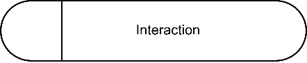

**Definition:** An Interaction represents a distinct unit of behavior or a scenario that the system executes. It encapsulates a sequence of events or actions. Unlike structural elements (which are static), Interactions are dynamic inventory items that describe *activity*.

**Usage:** Interactions are the primary nodes in Behavioral Context Diagrams and Interaction Breakdown Diagrams. They may represent behavior at different levels of abstraction, from a broad business scenario to a detailed process that is defined by a Process Diagram.

**Interaction Types:** SAIL defines three specific types of interactions to handle increasing levels of complexity:

1.  **Simple Interaction:**

> 

- *Definition:* An atomic high-level behavior that is not broken down further within the architectural model. It represents a “black box” activity.

- *Usage*: Used when the behavior is important to name, but its internal steps do not warrant architectural detailing.

- *Example:* “Archive Logs” (where the internal steps do not warrant architectural detailing).

2.  **Composite Interaction:**

> 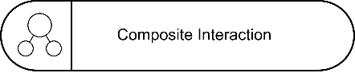

- *Definition:* A complex behavior that is composed of multiple smaller sub-interactions. It acts as a parent container for a detailed **Interaction Diagram**.

- *Usage*: Used to show the overall flow of a larger scenario without exposing every execution step. A Composite Interaction answers the question: “What named behaviors make up this scenario?”

- *Example:* “Place Order” (which breaks down into “Validate Payment,” “Check Inventory,” and “Save Order”).

3.  **Process Interaction:**

> 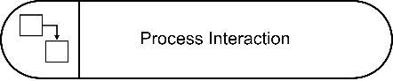

- *Definition:* A specific behavior that is defined by a rigorous step-by-step workflow. It is linked to a detailed **Process Diagram** that maps out the logic, decisions, and structural responsibilities.

- *Usage*: Used when the behavior must be specified precisely enough for implementation, validation, or architectural review.

- *Example:* “Validate Payment” (which maps to a process diagram showing the exact logic of calling the gateway, handling errors, and retrying).

**Relationship Between Composite and Process Interactions**

Composite Interactions and Process Interactions work together to support progressive disclosure.

A Composite Interaction shows the choreography of named behaviors. It is the preferred mechanism for breaking a large behavior into smaller pieces.

A Process Interaction shows the detailed execution of one named behavior. It is the preferred mechanism for showing how that behavior is performed by structural elements.

This distinction prevents large Process Diagrams from becoming overloaded. When a behavior grows too large to read comfortably, the architect should first consider whether the behavior should be decomposed into smaller Interactions using an Interaction Breakdown Diagram. Each detailed child behavior may then be modeled as its own Process Interaction with its own Process Diagram.

# Chapter 4: Structural Architecture

## 4.1 Purpose and Scope

**Structural Architecture** defines the static anatomy of the system. It answers the fundamental question: *What is the system made of?*

While behavior describes what the system *does* over time, structure describes what the system *is* at rest. It identifies the architectural components, their boundaries, and the physical connections between them. This pillar provides the stable “skeleton” upon which behavior is executed and quality attributes are measured.

The primary goals of modeling structural architecture are:

1.  **Scope Definition:** Distinguishing what is inside the system boundary versus what is external.

2.  **Decomposition:** Breaking down high-level complexity into manageable, modular components.

3.  **Dependency Mapping:** Visualizing the physical dependencies and communication pathways between parts.

## 4.2 Diagram: The Structural Context

The **Structural Context Diagram** is the “Black Box” view. It defines the scope of the system. Its purpose is to establish the system’s boundary and identify all external entities that interact with it.

### Rules

- **Allowed Elements:** **One System** (the subject of the diagram) and multiple **Boundary Participants** (representing the external environment).

- **Connections:** Communication Pathways link the System to the Boundary Participants.

- **No Internals:** No internal Service Units or Datastores are shown at this level. The system is opaque.

- **Labels:** At this high level, pathway labels are often omitted to reduce clutter, as the mere existence of a connection establishes the dependency.

### Example: Order Management System Context

The following diagram illustrates the context for an Order Management System. Note that the system is central, and it is surrounded by four distinct boundary participants: a Web Storefront, a Payment Gateway, a Warehouse System, and a Support Agent.

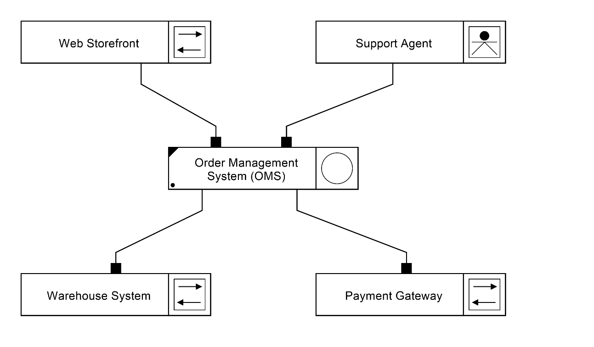

## 4.3 Diagram: Hierarchical Decomposition

The **Hierarchical Diagram** is the “White Box” view. It “explodes” a specific parent element (from a higher-level diagram) to show its internal composition.

### Standard Functional Decomposition

This is the most common form, used to show how a system works.

- **Context Group:** The boundary of the parent element is drawn as a labeled container (e.g., a dashed box labeled “Order Management System Context”).

- **Internal Elements:** Inside the boundary, the diagram displays the **Service Units**, **Datastores**, and **Subsystems** that make up the parent.

- **External Elements:** To show connectivity, any Boundary Participants or Systems that connected to the parent in the higher-level diagram are drawn *outside* the context group.

- **Traceability:** Every internal element must be a unique inventory item defined in the model.

### Special Case: Logical Aggregation

Sometimes, a hierarchical diagram is used only to define the membership of a group, rather than its connectivity. This is common for Boundary Participants (e.g., defining “Users” as a set of specific user roles).

- **Usage:** Used when the parent element is marked with the **Aggregation Indicator** (three dots).

- **Rule Exception:** For Logical Aggregation diagrams, showing connected external elements is **optional**. The focus is just on the internal list of constituents.

- **Example:** A “Users Breakdown” diagram might show the “Users” boundary containing “Admin User,” “Customer,” and “Auditor” without drawing any lines to the System.

### Example: Order Management System Internals

The diagram below shows the internal structure of the Order Management System. We can see it is composed of specific Service Units (like the Order API Handler and Order Orchestrator) and a Datastore (Orders DB). It also shows how the external actors connect to specific internal components.

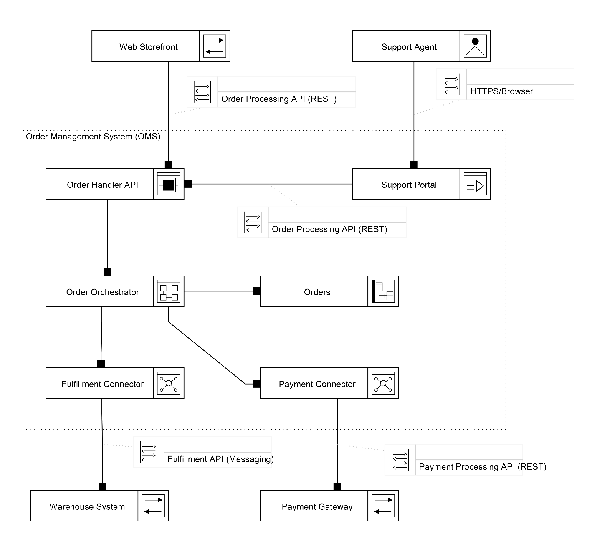

## 4.4 Interface Definitions

While structural diagrams show *that* components are connected, **Interface Definition Diagrams** define *how* they communicate. These diagrams specify the formal contracts referenced by the Communication Pathways.

### Purpose

To provide a canonical reference (“spec sheet”) for an interface, listing its supported operations and protocol details.

### Example Interfaces

The Order Management System relies on several key interfaces.

#### 1. Order Processing API (REST)

This interface defines the operations for creating and managing orders. It is provided by the OMS and consumed by the Web Storefront.

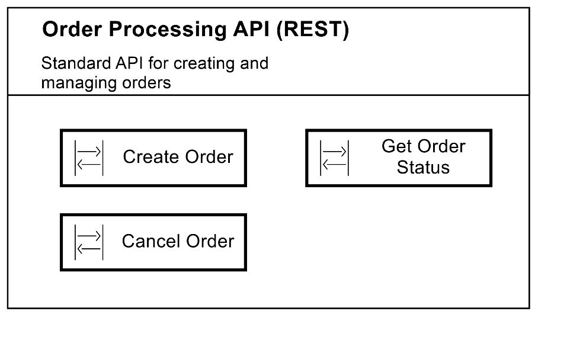

#### 2. Payment Processing API (REST)

This interface represents the external contract provided by the Payment Gateway.

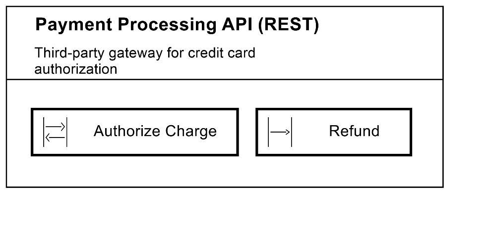

#### 3. Fulfillment API (REST)

This interface handles the asynchronous shipping requests sent to the Warehouse.

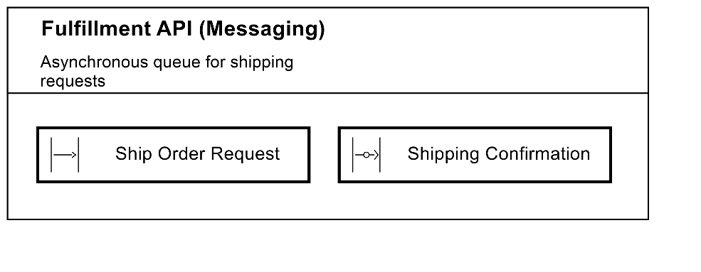

#### 4. HTTPS / Browser Access

This interface defines the user interaction channel for the Support Agent accessing the portal.

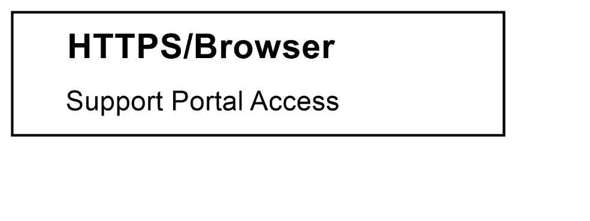

# Chapter 5: Behavioral Architecture

## 5.1 Purpose and Scope

**Behavioral Architecture** defines the dynamic runtime of the system. It answers the fundamental question: *What does the system do?*

While structure describes the static components, behavior describes how those components interact over time to fulfill business goals. This pillar captures the flow of data, the sequence of events, and the logic of decision-making.

The primary goals of modeling behavioral architecture are:

1.  **Scenario Definition:** Identifying the major use cases and interactions the system supports.

2.  **Flow Visualization:** Mapping the step-by-step sequence of operations across components.

3.  **Traceability:** Linking runtime actions back to the structural elements responsible for executing them.

**Indicator Rule:** Unlike structural diagrams where indicators (Drill-Down, Aggregation) are crucial for navigation, behavioral diagrams focus on process flow. Therefore, structural indicators are often suppressed on elements within Process and Interaction diagrams to reduce visual clutter and keep the focus on the activity.

## 5.2 Diagram: The Behavioral Context

The **Behavioral Context Diagram** provides a high-level overview of the system’s dynamic scope. Unlike the structural context (which shows static connections), this diagram shows *interactions*.

### Rules

- **Allowed Elements:** Boundary Participants (Actors) and **Interactions** (High-level Use Cases).

- **Connections:** Connectors link actors to the interactions they initiate or participate in.

- **No Internal Logic:** No process steps or internal components are shown. It is a map of “Who does what.”

### Example: Order Management System Behaviors

The diagram below shows the primary behavioral scenarios for the Order Management System. We see interactions initiated by different actors:

- The **Web Storefront** triggers the **Place Order** interaction.

- The **Support Agent** triggers the **Cancel Order** interaction.

- The **Warehouse System** triggers the **Ship Order** interaction.

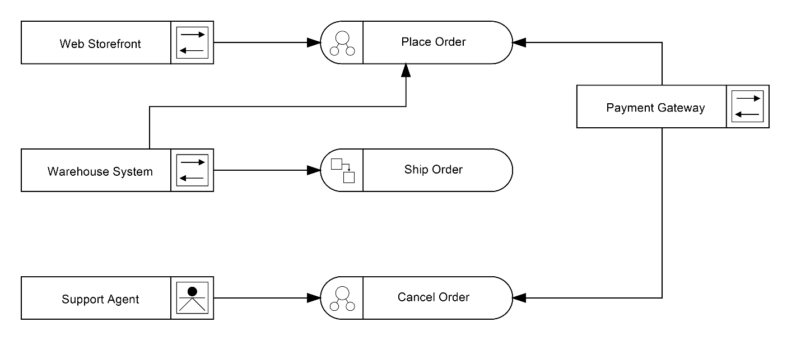

## 5.3 Diagram: Interaction Breakdown

Complex interactions often need to be decomposed before they can be detailed as execution flows. An Interaction Breakdown Diagram shows this decomposition, organizing a high-level Composite Interaction into smaller, manageable sub-interactions.

The purpose of this diagram is to show the behavioral structure of a scenario. It answers the question: ***“What named behaviors occur, and in what logical order?”***

This diagram is especially useful when a process would otherwise become too large to fit comfortably on a single Process Diagram. Rather than collapsing sections of a Process Diagram into informal sub-process boxes, SAIL models those sections as Interactions. Each Interaction can then be treated as its own architectural behavior, reused where appropriate, and detailed independently when needed.

### Rules

- **Composite Interaction:** The parent container representing the high-level scenario.

- **Sub-Interactions:** The internal steps, which can be **Simple Interactions** (atomic), **Process Interactions** (linked to a detailed flow), or other Composites.

- **Sequence:** Arrows between interactions indicates logical order of execution.

- **Participation:** Arrows from Boundary Participants indicate that the boundary participant participates in the interaction. Therefore, arrows between Boundary Participants and Interactions will always be drawn with the arrow pointing to the interaction.

- **Decomposition Before Detailing:** When a behavior contains multiple meaningful phases, reusable behaviors, or major branches, the architect should use an Interaction Breakdown Diagram before creating detailed Process Diagrams.

- **No Process-Level Detail:** Start nodes, End nodes, Process Steps, datastore writes, interface operation calls, and structural responsibility compartments do not appear on an Interaction Breakdown Diagram. Those details belong in the Process Diagram for the relevant Process Interaction.

- **Reuse:** A child Interaction may be referenced by more than one Composite Interaction when the same behavior occurs in multiple scenarios. Reuse should be explicit: the reused Interaction must have the same name and represent the same architectural behavior in every context.

### Example 1: Place Order (Composite)

The “Place Order” scenario is composed of a sequence of distinct activities. Note the strict dependency: the system must **Validate** the order and **Authorize Payment** before it can **Schedule Shipment**.

- *Validation* and *Persistence* are simple internal steps.

- *Authorize Payment* and *Schedule Shipment* are complex enough to require detailed Process Diagrams.

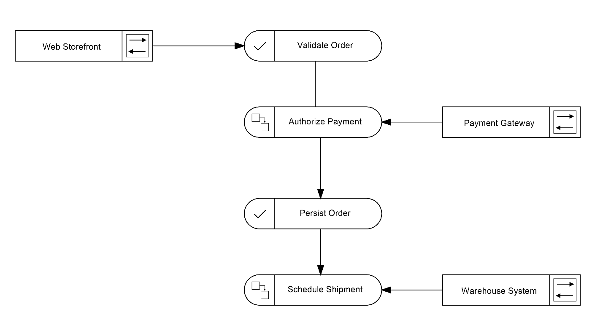

### Example 2: Cancel Order (Composite)

The “Cancel Order” scenario initiated by a Support Agent involves a different flow. It requires **Login** and **Retrieval** before the **Refund Payment** process can be triggered.

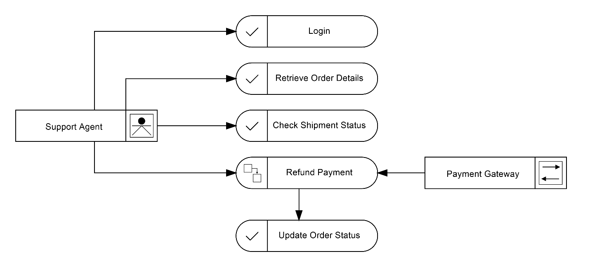

## 5.4 Diagram: Process Diagrams

The **Process Diagram** is the most detailed behavioral view. It depicts the exact step-by-step workflow of a single Process Interaction, including flows, decision outcomes, structural responsibilities, interface references, and architectural element references.

A Process Diagram answers the question:

**“How does this specific behavior execute?”**

It should not be used as the primary mechanism for decomposing a large scenario into named behaviors. That role belongs to the Interaction Breakdown Diagram. Instead, the Process Diagram defines the internal execution of one Process Interaction at a level precise enough to support implementation and review.

A Process Diagram may include Process Interaction references, rendered using the Interaction pill shape. When used inside a Process Diagram, the pill represents a Process Call: execution passes to another Process Interaction whose internal workflow is defined by its own Process Diagram.

A Process Call is used when the parent process must show the overall execution flow, but the called behavior is large enough, reusable enough, or distinct enough to deserve its own detailed Process Diagram.

A Process Call does not identify a responsible structural element in the parent diagram. The called Process Diagram is responsible for showing the structural elements, interface operations, datastore references, and detailed steps that execute the behavior.

### Rules

- **Flow Elements:** **Start** nodes, **End** nodes, and **Decision** flows.

- **Process Steps:** Each step must identify the **Structural Element** (Service Unit or System) responsible for the action.

- **Drill Down:** A step may show the drill-down marker to indicate that the current step breaks down into a sub-diagram showing a more detailed flow. Typically this is seen on high level process flows that break down into more detailed flows.

- **Interface References:** Steps that involve communication should reference the specific **Interface Operation** being used (e.g., \<Payment API:Authorize\>).

- **Element References:** Steps that access other elements in the architecture may refer to those using the name of the element in square brackets. This provides traceability in the step diagram between the responsible element and other elements that do not provide an explicit interface specification (e.g., Write order to \[Orders\]).

- **Decision Outcomes:** SAIL does not require a separate decision symbol. Branching is represented by labeled flows leaving the relevant Process Step or Process Call. Each label describes the condition or outcome that causes that flow to be followed.

- **One Incoming Flow Per Node:** To keep process diagrams readable, a Process Step or Process Call should have a single incoming flow. If the same action or called process is reached from multiple branches, the node should usually be duplicated rather than merged. This preserves the local meaning of each branch and reduces visual ambiguity. This rule does not apply to End Markers.

- **Duplication Over Merging:** Duplicating a small number of steps or calls is preferable to creating dense convergence points. If duplication becomes excessive, the repeated behavior may be a sign that it should be modeled as a reusable Process Interaction.

- **Process Calls:** Interaction pills may appear inside Process Diagrams only when they reference Process Interactions. They are not informal grouping devices. A Process Call must resolve to exactly one Process Interaction, and that Process Interaction must have its own Process Diagram if implementation detail is required.

### Example 1: Authorize Payment

This process details how the Order Orchestrator interacts with the Payment Gateway. It shows the Payment Connector acting as the intermediary to sending the Authorize Charge request.

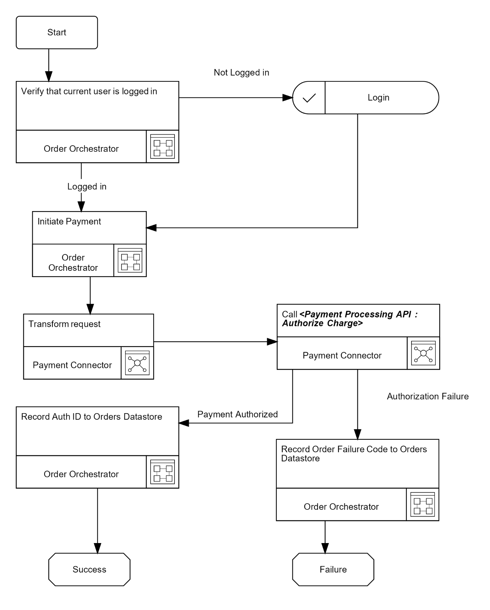

### Example 2: Schedule Shipment

This process maps the flow of sending a shipping request to the Warehouse. It highlights the use of the Fulfillment Connector and the Ship Order Request operation.

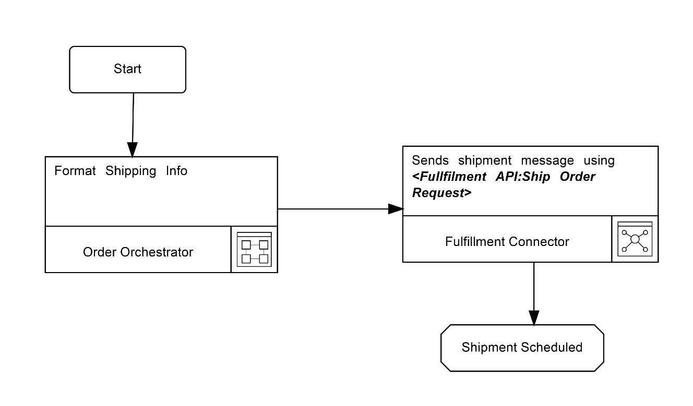

### Example 3: Ship Order (Confirmation)

This process models the asynchronous response from the Warehouse. It starts with the receipt of a Shipping Confirmation webhook and results in the order status being updated to “Shipped.”

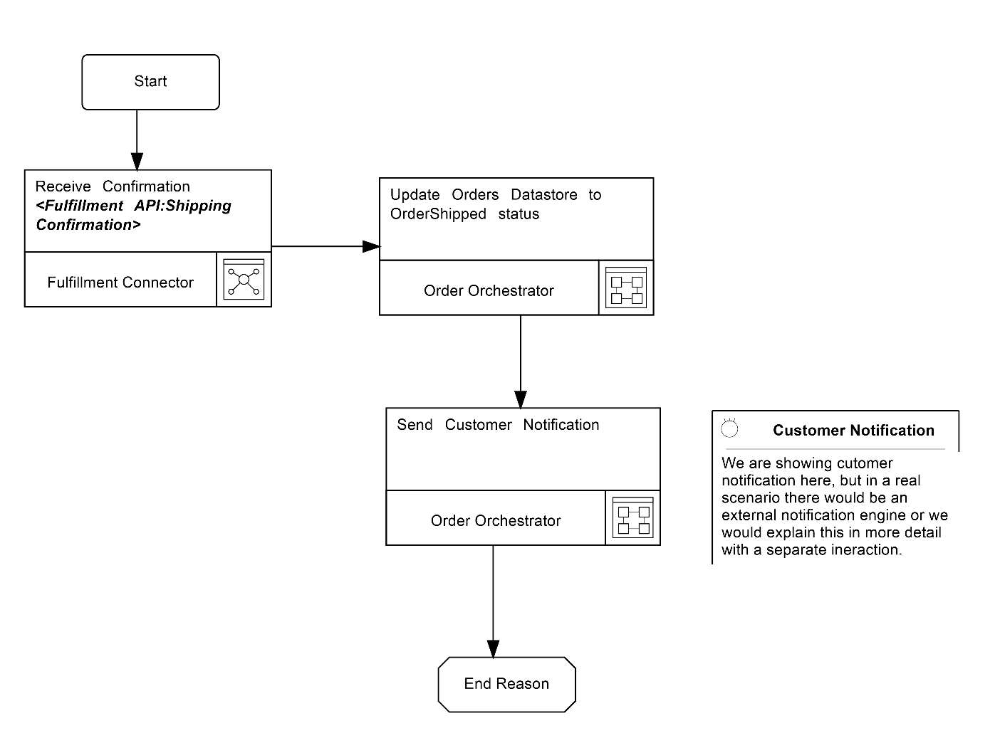

### Example 4: Refund Payment

This process outlines the refund logic used within the “Cancel Order” scenario.

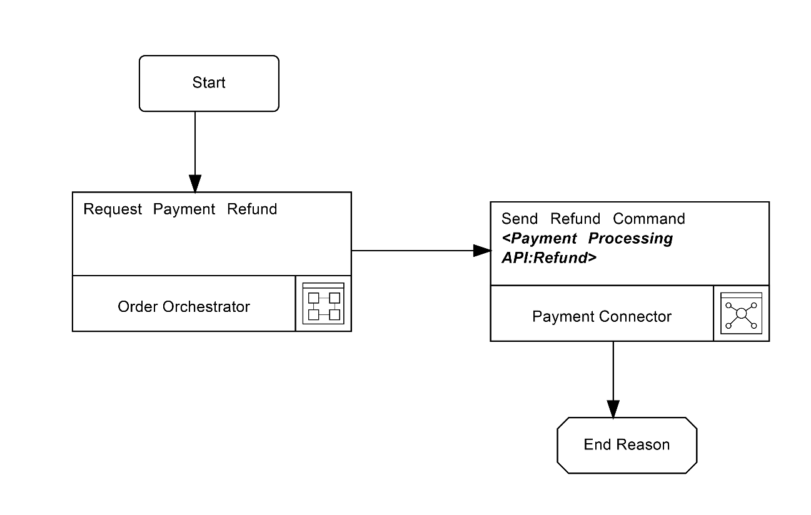

# Chapter 6: Intrinsic Architecture

## 6.1 Purpose and Scope

**Intrinsic Architecture** focuses on the internal qualities and properties of architectural elements that are not visible in the structural or behavioral views but are crucial to the system’s success. This includes **Non-Functional Requirements (NFRs)**—also known as quality attributes—such as performance, security, scalability, reliability, and compliance.

While Structure defines *what* the system is, and Behavior defines *what* it does, Intrinsic Architecture defines **how well** the system must perform its functions. It is the “Contract of Quality” that the architecture must fulfill.

The primary goals of modeling intrinsic architecture are:

1.  **Explicit Documentation:** Moving NFRs out of buried text documents and into the primary architectural model.

2.  **Traceability:** Linking specific quality constraints to the structural elements or interactions they govern.

3.  **Completeness:** Using standard categories to ensure no critical quality aspect (like security or observability) is overlooked.

## 6.2 Intrinsic Elements

Intrinsic architecture uses a specialized set of elements to create a structured hierarchy of requirements.

### 1. Modeled Element

The subject of the map. This is always a reference to an existing **Structural Element** (e.g., a System or Service Unit) or a **Behavioral Interaction**. It serves as the root of the hierarchy.

**Indicator Rule:** In a Characteristic Map, the Modeled Element is depicted with all of its compartments and indicators displayed. This provides the consumer with a complete visual reference of the element’s identity, including its drill-down status or aggregation markers, ensuring full context is available on the diagram.

### 2. Category

A high-level grouping of related qualities. Categories organize constraints into logical buckets to aid readability and analysis.

- *Examples:* Performance, Security, Scalability, Business Goals.

### 3. Characteristic

A specific, measurable attribute or requirement within a category. Characteristics define the actual constraint.

- *Examples:* “Response time \< 200ms”, “Data encrypted at rest”, “Support 5,000 concurrent users”.

- *Hierarchy:* Characteristics can be further broken down into sub-characteristics if granular detail is needed.

## 6.3 Diagram: The Characteristic Map

The **Characteristic Map** is the primary artifact for documenting intrinsic architecture. Unlike the organic “mind maps” used in early brainstorming, the formal SAIL Characteristic Map uses a **structured, hierarchical layout** to present qualities compactly and clearly.

### Visual Structure

- **Root (Top-Left):** The diagram is anchored by the **Modeled Element** ideograph (e.g., the System or Interaction icon).

- **Radiating Scope:** Lines or connectors extend from the root to the various **Categories**.

- **Category Containers:** Each Category is depicted as a distinct box or container.

- **Attribute Hierarchy:** Inside (or connected to) each Category, the **Characteristics** are listed in a structured hierarchy (Attribute -\> Sub-Attribute). This compact list format allows for dense information to be presented without visual clutter.

### Example: System-Level Characteristics

The diagram below shows the intrinsic qualities defined for the **Order Management System**. Notice how high-level concerns like “Scalability” and “Security” are broken down into specific targets like “10,000 orders/day” and “PCI-DSS Compliance.”

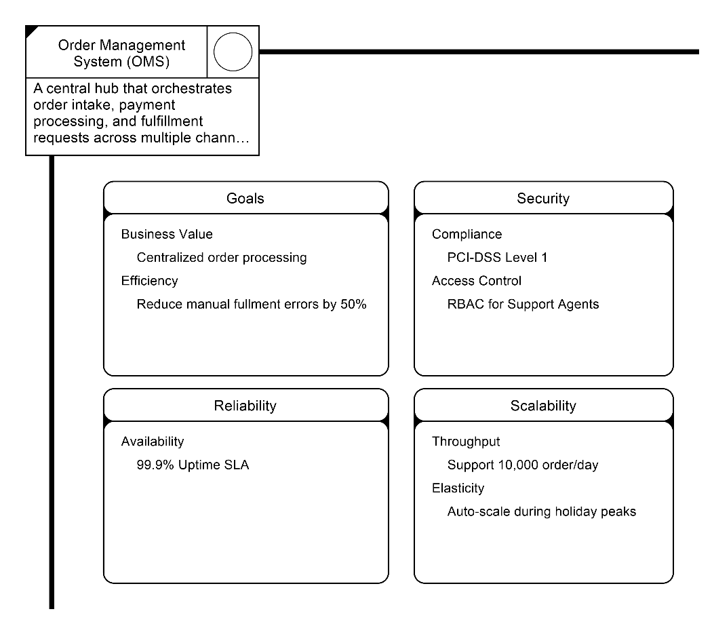

### Best Practices

- **One Map per Element:** Do not try to fit the qualities of multiple systems onto one map. Focus on one subject at a time.

- **Measurable Attributes:** Whenever possible, characteristics should be quantifiable (e.g., “99.9% uptime” is better than “High availability”).

- **Progressive Elaboration:** Early in a project, a map might only contain high-level “Business Goals.” As the architecture matures, technical categories like “Security” and “Performance” are populated with detailed metrics.

## 6.4 Recommended Categories by Element

To assist architects in capturing a complete intrinsic profile, SAIL provides a set of recommended categories for each element type. These lists combine core architectural concerns with specific NFRs to ensure comprehensive coverage.

### 1. System

Focuses on the high-level business and operational viability of the entire system.

| Name | Definition | Example |
| --- | --- | --- |
| Goals | The primary business objectives the system must achieve. | “Increase conversion rate by 10%” |
| Risks | Critical failure modes, project risks, or business threats. | “Vendor lock-in”,   “Regulatory changes” |
| Stakeholders | Individuals or groups with a vested interest in the system’s success. | “Compliance Officer”,   “Sales Team” |
| Constraints | Hard limitations imposed by budget, environment, or policy. | “Budget cap $50k”,   “Must run on-premise” |
| Security | The high-level security posture and compliance requirements. | “Zero Trust architecture”,   “PCI-DSS Level 1” |
| Scalability | Ability to handle growth in users, data, or traffic. | “Auto-scale to 10k concurrent users” |
| Reliability | Availability targets and recovery objectives. | “99.99% Uptime”,   “RTO &lt; 4 hours” |

### 2. Boundary Participant

Focuses on the nature of the external entity and the interface contract.

| Name | Definition | Example |
| --- | --- | --- |
| When | Frequency, timing, or availability windows of interaction. | “Batch nightly”,   “Real-time unpredictable” |
| Why | The business driver or intent for this integration. | “Payment processing”,   “Legacy data sync” |
| What | The nature of data exchanged (volume, sensitivity, format). | “PII data”,   “High throughput (&gt;1k/sec)” |
| How | Technical constraints on the connection protocol or method. | “SOAP only”,   “VPN required”, “Mutual TLS” |
| Security | Authentication requirements and trust level of the participant. | “Untrusted public user”,   “OIDC Integration” |

### 3. Datastore

Focuses on data governance, persistence, and protection.

| Name | Definition | Example |
| --- | --- | --- |
| Privacy | Requirements for data residency, PII handling, and sovereignty. | “GDPR Right to be Forgotten”,   “US-only storage” |
| Retention | Policies dictating data retention duration and disposal timing. | “Keep 7 years”,   “Purge inactive after 30 days” |
| Security | At-rest encryption standards and access control models. | “Field-level encryption”,   “Read-only replica access” |
| Consistency | The required consistency model (Strong vs. Eventual). | “Strong consistency for financial ledger” |
| Availability | Uptime requirements and failover strategies. | “Active-Active replication”,   “Multi-region” |

### 4. Service Unit

Focuses on the specific responsibilities and implementation qualities of a component.

| Name | Definition | Example |
| --- | --- | --- |
| Responsibility | The clear, single responsibility definition for the unit. | “Manage Order State”,   “Transform Payment Request” |
| Collaboration | Dependencies, coupling, and interaction patterns with other units. | “Highly coupled to Payment Gateway”,   \|”Event-driven” |
| Actions | Key functions or operations performed by the unit. | “Validate inputs”,   “Route messages”,   “Calculate tax” |
| Security | Component-level hardening and defensive coding requirements. | “Input sanitization”,   “Service account least privilege” |
| Performance | Latency and throughput targets for the component. | “Processing time &lt; 50ms” |
| Testability | Requirements for unit testing coverage or mockability. | “80% code coverage”,   “Mockable external dependencies” |

### 5. Interaction

Focuses on the dynamic flow, transactional guarantees, and outcomes.

| Name | Definition | Example |
| --- | --- | --- |
| Trigger(s) | The event or condition that initiates the flow. | “User clicks submit”,   “Cron schedule”,   “Webhook received” |
| Pre-Conditions | State that must be true before the interaction can begin. | “User logged in”,   “Inventory available &gt; 0” |
| Post-Conditions | State guaranteed to be true after successful completion. | “Order ID created”,   “Email sent”,   “Inventory reserved” |
| Goal(s) | The successful outcome or business value delivered. | “Secure customer payment”,   “Schedule shipment” |
| Constraints | Hard limitations on execution (time, resources). | “Must complete in 500ms”,   “No external calls allowed” |
| Risks | Specific failure scenarios to mitigate. | “Network partition”,   “Duplicate message delivery” |
| Stakeholders | Who is impacted by or cares about this specific flow. | “Customer Support”,   “Finance Team” |
| Performance | End-to-end latency or throughput requirements for the flow. | “Total response time &lt; 2s” |

# Chapter 7: Enhancing Diagrams

SAIL emphasizes clarity and simplicity. Beyond the core definitions of elements and connections, there are optional enhancements and notational aids that improve readability and aesthetics without altering the architectural meaning. These are presentational techniques—they should be used to aid understanding.

## 7.1 The Principle of Semantic Independence

A fundamental rule for all enhancements in SAIL is **Semantic Independence**. None of the visual aids described in this chapter (Context Groups, Notations, or Color) change the underlying architectural model.

- **Test of Validity:** If you strip a diagram of all color, context groups, and notation notes, the remaining black-and-white nodes and connectors must still form a valid, complete, and correct architectural description.

- **Role of Enhancements:** These features exist for the human reader. They guide the eye, provide meta-context, or explain “why,” but they never define “what” the system is or does. That definition resides in the Elements and Connections.

## 7.2 Visual Organization: Context Groups

**Context Groups** are a visual organizational aid. They appear as labeled regions or bands on a diagram that enclose a set of elements to imply a shared context, location, or theme.

### Purpose

- **Visual Separation:** To group elements that belong to a specific subsystem, deployment zone (e.g., “AWS Region”), or logical domain.

- **Simplification:** To label a complex cluster of components with a single meaningful name (e.g., “Legacy Mainframe System”) without modeling it as a single element if the internal detail is still needed.

### Rules

- **No Functional Meaning:** Context groups do not change the architecture. If you remove the group boundary, the connections and elements remain valid.

- **Labeling:** Keep labels short and descriptive (e.g., “Mobile Clients,” “Data Warehouse Layer”).

- **Nesting:** Avoid deep nesting. One level of grouping is often sufficient to clarify the diagram.

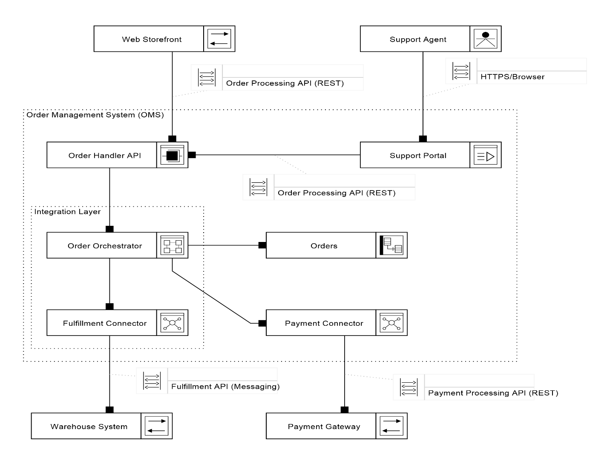

## 7.3 Notations

While Context Groups organize the *architecture*, **Notations** organize the *diagram itself*. Notations are explicit markers used to add meta-information, explanations, or workflow tracking to a view. Like context groups, they have no semantic impact on the system design but are critical for the human reader.

### Purpose

Notations bridge the gap between a strict architectural model and a communicative document. They allow architects to explain *why* a decision was made, mark areas for future work, or provide legends for custom icons.

### Kinds of Notations

SAIL defines a standard set of notation kinds to ensure these notes are recognizable and distinct from architectural elements.

| Kind        | Glyph                                                                                          | Description                                                                                                                  |
|-------------|------------------------------------------------------------------------------------------------|------------------------------------------------------------------------------------------------------------------------------|
| Annotation  |   | A general-purpose sticky note or comment attached to an element or area for clarification.                                   |
| Concept     |  | Highlights a key architectural pattern or insight (e.g., “This uses the Strangler Fig pattern”).                             |
| Information |   | Meta-data about the diagram itself, such as Author, Date, Version, or Status (Draft/Approved).                               |
| Legend      |  | A key explaining color codes, custom icons, or specific line styles used in the diagram.                                     |
| Rationale   |  | Explains the reasoning behind a specific design choice or tradeoff. Can link to a formal Architecture Decision Record (ADR). |
| ToDo        |   | A marker for incomplete areas or questions that need resolution (e.g., “Verify latency requirements”).                       |

### Usage Best Practices

- **Use Rationale for “Why”:** Don’t just draw the “What.” Use a Rationale note to explain *why* a specific database was chosen or why a direct connection exists.

- **Temporary vs. Permanent:** ToDo notes are temporary and should be cleared before final release. Rationale and Concept notes are permanent valuable context.

- **Don’t Clutter:** Use notations to explain non-obvious things. If the diagram speaks for itself, avoid adding redundant annotations.

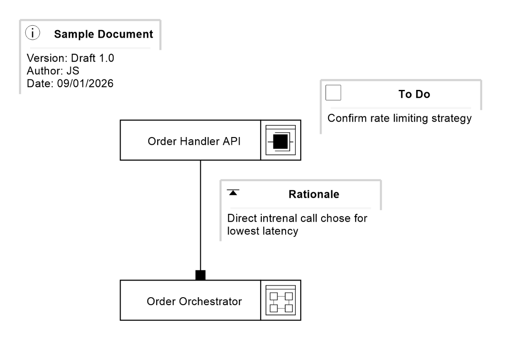

## 7.4 Use of Color

Color can be a powerful visual aid, but in SAIL it is optional and should be used with a minimalist philosophy.

### Guidelines

- **Use Sparingly:** Diagrams should be readable in black and white. Use color only to highlight specific concerns (e.g., coloring all “External” systems gray).

- **Consistency is Key:** If you use Blue for “User Interface” components, be consistent across *all* diagrams in the documentation. Random coloring confuses the reader.

- **Element Backgrounds:** Muted background colors can be used now and then on elements to distinguish them, but must not distract from the architecture. SAIL favors the use of border colors over background fills to maintain clarity. Context Groups do not have a background fill; they rely on borders and labels to define their area.

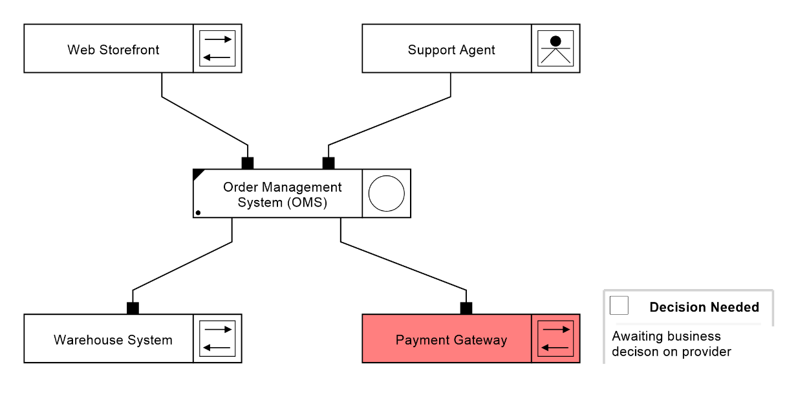

## 7.5 The Stand-In Element

Complex systems often contain groups of elements that have different internals but share identical external connectivity or reside within the same physical package. Modeling every individual connection for these elements can result in a “spaghetti diagram” that obscures the high-level architecture.

To address this, SAIL defines the **Stand-In Element**.

**Definition:** A Stand-In is a structural element that acts as a visual proxy for a collection of **distinct but related** elements of the same Type. It allows the architect to model connectivity once for the group, rather than repeating lines for every constituent.

**Visual Representation:** A Stand-In is represented by the standard structural shape (Square, Circle, or Rectangle) but is distinguished by a **Heavy (Bold) Border**.

- **Standard Element:** Normal line weight (1px–2px).

- **Stand-In Element:** Heavy line weight (4px–6px).

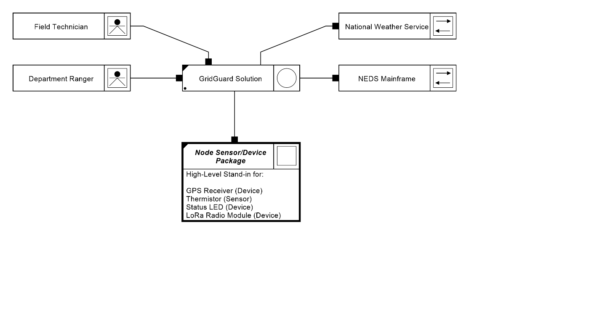

**Inventory and Traceability:** A Stand-In is not a vague generalization; it is a strict alias for specific items in the system inventory. **To stand in for other elements, those elements must exist in the architecture.** A Stand-In cannot represent “undefined future things”; it must represent concrete elements defined in the model.

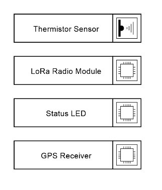

**The Sub-Diagram:** To maintain this traceability, a Stand-In element often displays the **Sub-Diagram Indicator** (the solid triangle in the header). This signals that the element can be “opened” to reveal the constituents it represents.

- The linked diagram is a **Logical Aggregation** view (see Section 4.3).

- This sub-diagram does not show wiring or flow; its primary purpose is to enumerate the specific elements that the Stand-In is acting as a proxy for (e.g., a “Users” Stand-In exploding into “Admin,” “Editor,” and “Viewer”).

**Usage Rules:**

1.  **Implicit Connectivity:** Any Communication Pathway connected to a Stand-In Element implies a connection to *all* the elements represented by that Stand-In.

2.  **Same Type Constraint:** A Stand-In must be the same **Type** as the elements it represents (e.g., a Square Stand-In represents a group of Boundary Participants).

**Distinction from Multiple Instances:** It is important to distinguish the Stand-In from the **Multiple Instance Indicator** (the “three dots” described in Section 2.3).

- **Multiple Instance (Three Dots):** Represents a cluster of *identical* copies (e.g., a server farm of 10 identical web nodes).

- **Stand-In (Heavy Border):** Represents a collection of *distinct* items (e.g., “GPS” and “Thermistor”—two different devices that share a physical package and connectivity).

# Chapter 8: Validation Rules

To ensure consistency and correctness in SAIL diagrams, a set of **validation rules** is defined. These rules act as constraints on how elements can be used in each type of diagram and what structures are considered valid SAIL models. Adhering to these rules guarantees that the diagrams remain interpretable and follow the intended semantics of the language.

## 8.1 Structural Rules

These rules govern the static definition of the system in Structural Context and Hierarchical diagrams.

### Structural Context Diagrams

- **Single System Rule:** A structural context diagram **must include only one** System element representing the entire system under consideration. This central System is the focus of the context.

- **Boundary-Only Externals:** Besides the one System, the **only other elements allowed** on a context diagram are Boundary Participants (as external actors/systems). No other structural element types (e.g., Service Units, Datastores) should appear at this level.

- **Permitted Connections:** Communication Pathways are permitted to show interfaces between the System and each Boundary Participant. These should connect the System to the external entities. Since this is a high-level view, **pathway labels are optional** and often omitted to avoid clutter.

### Hierarchical Diagrams

- **Exploded View of Parent:** A hierarchical structural diagram represents an “exploded” view of a **single parent element** from a higher-level diagram. Everything inside the context group is part of that parent.

- **Include Connected Externals (Functional View):** For standard functional decompositions (e.g., System -\> Service Units), the diagram **should include all elements that connect to the parent element** (from upper-level diagrams) by showing them outside the parent’s context boundary. This ensures continuity and context.

- **Aggregation Exception:** If the diagram represents a **Logical Aggregation** (e.g., expanding a “Users” group into specific roles), including external connections is **optional**. The diagram may focus only on defining the constituents.

- **Contain Internal Elements:** The diagram must contain the internal elements that make up the parent (Systems, Service Units, Datastores). Together, these elements must account for the functionality of the parent.

- **No Stray Elements:** All elements on the diagram should either be part of the parent (inside the context) or connected to the parent (placed outside). Floating, unconnected elements are invalid (unless in an Aggregation diagram where connections are omitted).

- **Service Units are Terminal:** Service Units represent the lowest level of structural decomposition in SAIL. A Service Unit should **never** have a drill-down marker or a subordinate Hierarchical Diagram.

## 8.2 Behavioral Rules

These rules govern the dynamic flow in Context, Interaction, and Process diagrams.

### Behavioral Context Diagram

- **Allowed Elements:** This diagram **should only include** Boundary Participants, Interactions, and Connectors. No internal structural elements (Service Units) should appear here.

- **Actor-to-Interaction:** Every connector must link a Boundary Participant to an Interaction. This map shows “Who participates in What.”

### Interaction Diagrams

- **Focus on Decomposition:** An interaction diagram should contain only Interactions, Connectors, and relevant Boundary Participants. **No process-level elements** (Start, End, Process Step) should be present.

- **Clear Flow:** Connectors represents a logical or temporal flow. It should be clear what triggers what (e.g., Interaction A -\> Interaction B).

- **Consistency:** Any Boundary Participant or top-level Interaction that appears must also exist in the context diagram or be a valid decomposition thereof.

### Process Diagrams

- **Allowed Elements:** A process diagram **should include only** one Start, one or more Process Steps, one or more End nodes, and Flows connecting them.

- **Single Start:** Every process diagram starts with **just one** Start node.

- **Step Responsibility:** **Every Process Step must reference a responsible structural element.** A step without an owner is invalid.

- **Existence Check:** Any structural element named as responsible for a Process Step **must exist** in the structural model.

- **Interface Operations:** If a step involves communication, that step should reference a valid Interface Operation using the syntax \<Interface:Operation\>.

- **Connected Flows:** All flows need to link together in the correct sequence (Start -\> Step -\> End). Hanging arrows are invalid.

## 8.3 Intrinsic Rules

These rules govern the quality attribute definitions in Characteristic Maps.

### Characteristic Map Diagrams

- **Single Focus Element:** A characteristic map must focus on **one and only one Modeled Element**.

- **Allowed Elements:** Only Modeled Element, Category, and Characteristic elements are allowed. No structural or behavioral flow elements.

- **Hierarchy via Containment:** Characteristics must be grouped or nested within their respective **Category** containers. This implies the relationship without requiring explicit connector lines.

- **Unique Categories:** Category names should be unique within a single map to avoid ambiguity.

## 8.4 Cross-Pillar Consistency

These rules ensure the three pillars (Structure, Behavior, Intrinsic) describe the same system.

- **Consistent Naming:** To ensure traceability, any architectural element (System, Service Unit, etc.) that appears in multiple diagrams **must use the exact same name** in every instance.

- **Interface Existence:** Any Interface referenced in a Structural Communication Pathway or a Behavioral Process Step must have a corresponding **Interface Definition**.

- **Behavioral-Structural Link:** Every “Responsible Element” in a Process Diagram must define a valid element in the Structural Hierarchy. You cannot assign behavior to a component that doesn’t exist in the Structural Architecture.

## 8.5 Validation Checklist

Use this checklist to verify model compliance by hand or via automated tooling.

### Structural Context Validation (STR-CTX)

- \[STR-CTX-01\] Diagram contains only one **System** element.

- \[STR-CTX-02\] All other elements are **Boundary Participants**.

- \[STR-CTX-03\] **No Service Units** or **Datastores** appear.

- \[STR-CTX-04\] All connections are between the **System** and **Boundary Participants**.

### Hierarchical Decomposition Validation (STR-DEC)

- \[STR-DEC-01\] Diagram defines a single **Parent Context**.

- \[STR-DEC-02\] All internal elements (**Subsystems, Service Units, Datastores**) are inside the context boundary.

- \[STR-DEC-03\] All external elements (**Boundary Participants**, sibling **Systems**, etc.) are outside the boundary.

- \[STR-DEC-04\] **Exception:** If diagram is an *Aggregation Breakdown* (e.g., User Roles), connected externals are optional.

- \[STR-DEC-05\] **Service Units** do not have drill-down markers (they are terminal).

### Behavioral Context Validation (BEH-CTX)

- \[BEH-CTX-01\] Contains only **Boundary Participants** and **Interactions**.

- \[BEH-CTX-02\] Connectors link **Boundary Participants** to Interactions (no **Boundary Participant-to-Boundary Participant** links).

- \[BEH-CTX-03\] No internal **Service Units, Datastores, Systems** or **Process Steps** appear.

- \[BEH-CTX-04**\] Boundary Participants** links to **Interactions** always draw the arrow on the **Interaction** to indicate participation in the interaction.

### Interaction Validation (BEH-CTX)

- \[BEH-INT-01\] Contains only **Boundary Participants** and **Interactions**.

- \[BEH-INT-02\] Connectors link **Boundary Participants** to **Interactions** and **Interactions** to **Interactions**.

- \[BEH-INT-03\] No internal **Service Units, Datastores, Systems** or **Process Steps** appear.

- \[BEH-INT-04\] **Boundary Participants** links to **Interactions** always draw the arrow on the **Interaction** to indicate participation in the interaction.

- \[BEH-INT-05\] **Interaction** to **Interaction** links are drawn to show logical progression.

- \[BEH-INT-06\] **Interaction** to **Interaction** links may contain labels if conditional processing is to be shown.

### Process Diagram Validation (BEH-PROC)

- \[BEH-PROC-01\] Contains only one **Start** node.

- \[BEH-PROC-02\] Contains at least one **End** node.

- \[BEH-PROC-03\] Every **Process Step** references a valid **Structural Element**.

- \[BEH-PROC-04\] If step uses an interface, the syntax \<Interface:Operation\> is used.

- \[BEH-PROC-05\] All flow paths are continuous from Start to End (no hanging nodes).

### Intrinsic Map Validation (INT-MAP)

- \[INT-MAP-01\] Focuses on just one **Modeled Element**.

- \[INT-MAP-02\] **Characteristics** are contained or grouped by **Category**.

- \[INT-MAP-03\] No structural or behavioral flow elements appear.

### Cross-Model Consistency (GEN-CON)

- \[GEN-CON-01\] **Name Consistency:** Element names match across all diagrams.

- \[GEN-CON-02\] **Interface Check:** Referenced interfaces exist in the Interface Definition catalog.

- \[GEN-CON-03\] **Structure Check:** Responsible elements in Process Steps exist in the Structural Hierarchy.

# Chapter 9: Extending SAIL

While SAIL provides a robust set of standard elements and notations, specialized domains often require specific vocabulary. **Extending SAIL** allows architects to customize the language for their specific environment—whether it’s Cloud Architecture, Healthcare, or Embedded Systems—without breaking the core principles that make diagrams readable.

## 9.1 The Extension Philosophy

SAIL is designed to be extensible but rigid in its grammar. The philosophy is simple: **You can invent new adjectives (Kinds), but you cannot invent new nouns (Types).**

- **Preserve the Pillars:** The concepts of Structure, Behavior, and Intrinsic qualities are immutable.

- **Preserve the Shapes:** The base shapes (Circle, Square, etc.) provide the fundamental “reading grid” of the diagram. These must remain constant so that any SAIL reader knows “Circle = System” even if they don’t recognize the specific icon inside it.

- **Extend the Content:** You are encouraged to create new **Kinds** (icons) and **Categories** (intrinsic qualities) to match your domain.

## 9.2 Extending Iconography (Kinds)

The primary mechanism for structural extension is defining new **Kinds**. A Kind is simply a specialization of a standard Element Type, denoted by a custom icon glyph.

### Rules for New Kinds

1.  **Respect the Base Shape:** A new kind of System must still be a Circle. A new kind of Service Unit must still be a Rectangle with Header.

2.  **Visual Clarity:** Custom icons should be simple, high-contrast glyphs (SVG/monochrome preferred) that fit well within the standard icon compartment (approx. 30x30px).

3.  **Cataloging:** When you introduce a new Kind, you must define it in your project’s legend or standards document.

### Example: Cloud Architecture Extension

A team migrating to AWS might extend the **System** and **Datastore** types with vendor-specific icons:

| **Name** | **Icon**                                                                                      | **Description**                                                                     |
|----------|-----------------------------------------------------------------------------------------------|-------------------------------------------------------------------------------------|
| Lambda   |  | A Circle containing the AWS Lambda logo. (Represents a serverless function system). |
| S3       | 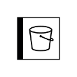 | A Datastore square containing the S3 bucket icon. (Represents object storage).      |
| DynamoDB |  | A Datastore square containing the DynamoDB icon.                                    |

### Example: Healthcare Extension

A medical device team might extend the **Boundary Participant** type:

| **Name**       | **Icon**                                                                                      | **Description**                                      |
|----------------|-----------------------------------------------------------------------------------------------|------------------------------------------------------|
| Patient        |  | A Square containing a medical cross or patient icon. |
| Imaging Device |  | A Square containing an MRI scanner icon.             |

## 9.3 Extending Intrinsic Categories

The standard intrinsic categories (Performance, Security, etc.) cover most software needs, but specific industries have unique compliance or operational constraints. You can extend SAIL by defining new **Intrinsic Categories**.

### Rules for New Categories

1.  **Orthogonality:** Ensure the new category doesn’t overlap with existing ones. (e.g., Don’t create “Speed” if “Performance” already exists).

2.  **Definition:** Define what characteristics belong in this category.

3.  **Scope:** Identify which elements this category applies to.

### Example: Clinical Safety

For a medical system, standard reliability isn’t enough. A new **“Clinical Safety”** category might be added to the Characteristic Map.

- **Characteristics:** “ISO 14971 Compliance”, “Fail-Safe Default”, “Alarm Latency \< 1s”.

### Example: Data Sovereignty

For a GDPR-focused system, a **“Data Sovereignty”** category might be essential for Datastores.

- **Characteristics:** “EU-Only Storage”, “Right to Erasure Support”, “No Cross-Border Replication”.

## 9.4 Creating a Dialect

When a team defines a consistent set of custom Kinds and Categories, they create a **SAIL Dialect**. This is a powerful way to standardize architecture across a large organization.

**Best Practice:** Publish your Dialect as a shared “SAIL Kit” or template library. This ensures that when Team A draws a “Microservice,” Team B recognizes the icon at once.

# Chapter 10: Summary and Conclusion

**Software Architecture Iconographic Language (SAIL)** provides a comprehensive yet accessible framework for modeling system architecture. By organizing architectural concerns into three equal pillars—Structural, Behavioral, and Intrinsic—SAIL ensures that all critical aspects of a system are documented with appropriate rigor.

## 10.1 Review of Benefits

SAIL addresses the common friction points in architectural documentation by offering:

1.  **Clarity over Ambiguity:** The strict “Iconographic” approach eliminates the guesswork of interpreting random boxes and lines. A circle is always a System; a square is always a Boundary Participant.

2.  **Three-Pillar Balance:** It treats *how well* a system performs (Intrinsic) and *what it does* (Behavior) as equal partners to *what it is made of* (Structure). This prevents the common “Diagram of Death” where NFRs and flows are crammed into a static structural view.

3.  **Accessibility:** The notation is designed to be readable by non-architects. Business stakeholders can validate a Context Diagram, and developers can implement from a Process Diagram, using the same language.

4.  **Technology Independence:** By focusing on architectural patterns (Types) rather than specific implementations (Kinds), SAIL models remain stable even as underlying technologies change.

## 10.2 Adopting SAIL in an Organization

Adopting a new modeling language can be daunting. SAIL is designed for incremental adoption. You do not need to model everything to get value.

### The Minimum Viable Model (MVM)

For most projects, a complete architectural baseline can be established with just 3–5 core diagrams. This “MVM” delivers 80% of the value with 20% of the effort.

1.  **Structural Context Diagram:** Define the scope. Who are the users? What are the external systems? (1 Diagram).

2.  **Behavioral Context Diagram:** Define the scope of action. What are the top 5 high-level interactions? (1 Diagram).

3.  **Hierarchical Diagram:** Explode the central system one level down to show major components (Service Units) and Datastores. (1 Diagram).

4.  **System Characteristic Map:** Capture the top-level goals, risks, and security constraints. (1 Diagram).

### Typical Modeling Workflow

1.  **Start with Structure:** Draw the Context Diagram to agree on boundaries.

2.  **Layer in Intrinsic Goals:** Draft the high-level Characteristic Map to agree on *why* we are building it (Goals, Risks).

3.  **Define Behavior:** Map out the critical user flows in a Behavioral Context.

4.  **Drill Down:** Create Hierarchical diagrams for the System and Process diagrams only for the complex interactions that need detailed specification.

### Scaling Beyond the Minimum

It is important to note that the Minimum Viable Model is just a starting point. While a single hierarchical diagram and one characteristic map may suffice for smaller systems, **SAIL is designed to describe the entire architecture of complex, large-scale systems.**

A completed SAIL model often includes:

- **Deep Hierarchies:** Systems composed of Subsystems, which are further decomposed into Service Units across multiple nested diagrams.

- **Granular Intrinsic Maps:** Characteristic maps not just for the System, but for individual Service Units (e.g., specific performance budgets) and critical Interactions (e.g., transactional guarantees for payment flows).

- **Comprehensive Behavior:** A library of Interaction and Process diagrams covering all edge cases, error flows, and asynchronous events.

Architects should feel empowered to expand the model depth as needed to specify the complete solution. The MVM ensures you start with value; the full language ensures you never outgrow the tool.

## 10.3 Future Outlook

SAIL is an evolving specification. As software architecture moves towards more distributed, event-driven, and AI-assisted patterns, SAIL is designed to adapt.

- **Tooling:** Future tools will support automated validation of SAIL models (checking rules like “Every Process Step must have a responsible element”).

- **Machine Readability:** The structured nature of SAIL (Categories, Kinds, specific relationships) makes it an excellent candidate for “Architecture as Code” and automated analysis.

- **Community Extension:** Through the extension mechanisms defined in Chapter 9, the community can build shared libraries of icons and categories for emerging domains like Quantum Computing or Edge AI.

By adopting SAIL, architects move away from “drawing pictures” and towards “engineering models”—creating artifacts that are rigorous, maintainable, and valuable throughout the software lifecycle.
